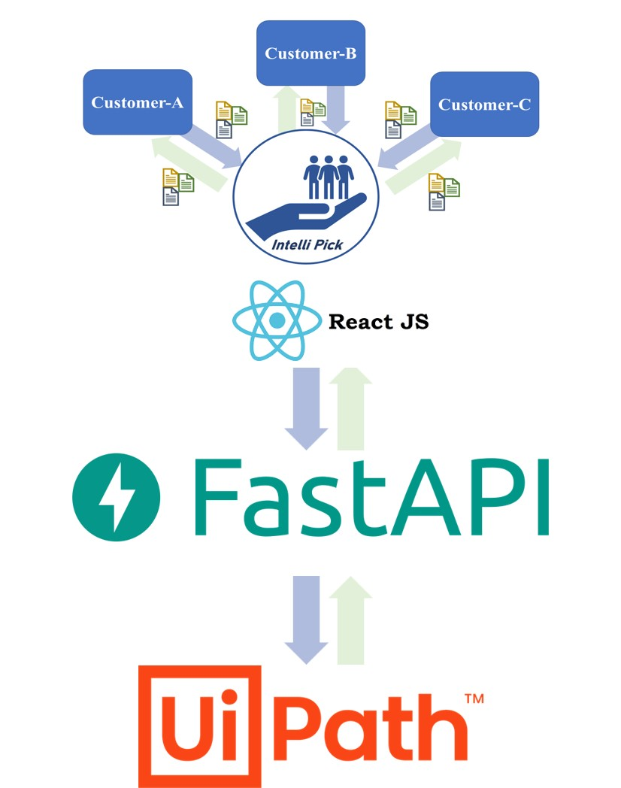
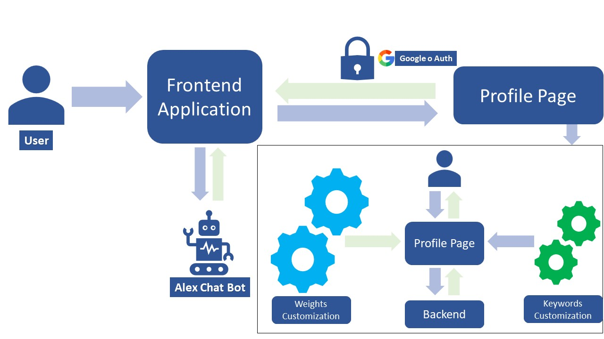
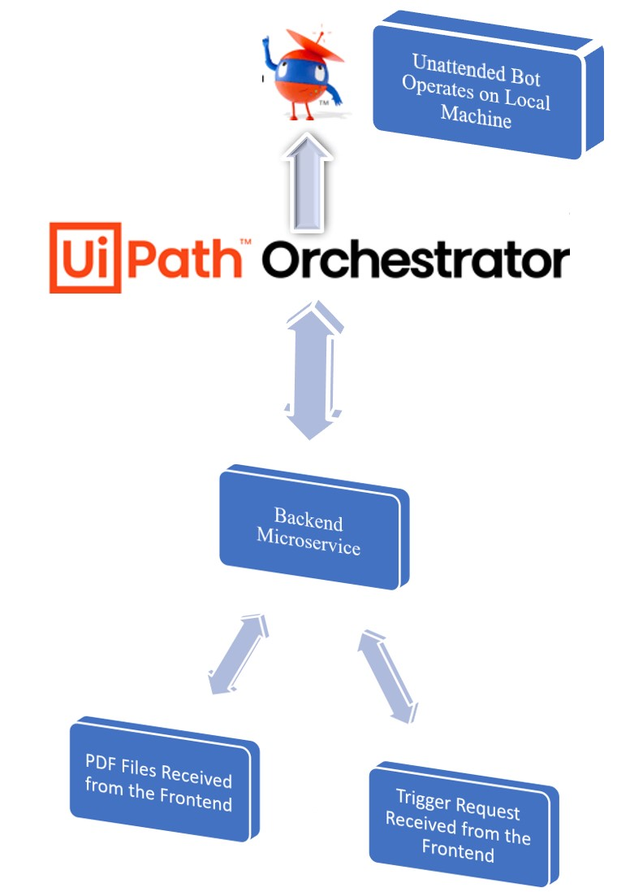
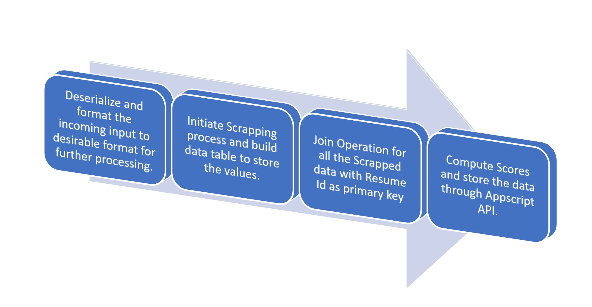

# IntelliPick

## Your Goto Tool to Automate and Faciliate the Tech Hiring Workflow


IntelliPick is an end to end Web Application that uses RPA to fetch data from public profiles and created a weighted score that can be used to rank the profiles. The weights are fully customizable and can be adjusted based on one's requirements.

## Table of Contents

- [IntelliPick](#intellipick)
  - [Your Goto Tool to Automate and Faciliate the Tech Hiring Workflow](#your-goto-tool-to-automate-and-faciliate-the-tech-hiring-workflow)
  - [Table of Contents](#table-of-contents)
  - [Process Flow Chart](#process-flow-chart)
      - [Frontend Container](#frontend-container)
    - [Graphics](#graphics)
    - [uipath_files](#uipath_files)
    - [uiPath_python](#uipath_python)
  - [High Level Flow Charts](#high-level-flow-charts)
    - [Frontend Application Flow Chart](#frontend-application-flow-chart)
    - [Microservice Architecture Flow Chart](#microservice-architecture-flow-chart)
    - [UIPath Operation Flow Chart](#uipath-operation-flow-chart)
  - [Tech Stack Used](#tech-stack-used)
    - [Frontend Tech Stack](#frontend-tech-stack)
    - [Backend Tech Stack](#backend-tech-stack)
  - [Setup Instructions](#setup-instructions)
  - [Credits](#credits)

## Process Flow Chart

The users are able to interact with the application through a Web App which then pings the microservices to fetch the relevant data and compute the results accordingly.

Folder structure:

```
frontend
└── hr_profiler
    └── src
└── graphics
└── uipath_files
└── uipath_python
```

#### Frontend Container

Here is the [frontend container](frontend/hr_profiler) and you can find all of the React files in this container.

### Graphics

Includes majorly images and the files that are used in README instructions.

### uipath_files

[Includes](uipath_files/) all of the UIPath Files and it's hierarchy. The detailed folder structure can be found in the UIPath Section.

### uiPath_python

[Includes](uiPath_python/) all of the FAST API files that are used to host the microservice on Heroku. Additionally, since the Heroku has a timeout of 30s and web sockets and https are not supported simaltaneously another microservice is deployed as a cloud function on google cloud which does the same thing as `async def trigger_ui_path(req:Request)` and can be [found here](uiPath_python/main.py). The file is not added to this repository as it contained uipath secrets and appscript secrets that are also ignored in the current configuration.

Includes all of the UIPath Files and it's hierarchy. The detailed folder structure can be found in the UIPath Section.

## High Level Flow Charts

The microservice architecture is built on Fast API and all of it's dependencies can be located


### Frontend Application Flow Chart

The frontend application makes use of Google oAuth to authenticate the user Identity after which they are good to go with availing the services.



### Microservice Architecture Flow Chart

The Backend API recieves the uploaded files in bytes and then decodes the bytes to get back the PDF file. Once the PDF files are extracted, the microservice returns an array of object that contains the resume id which is generated in runtime followed by the uri and also if that particular URI is identified by our system or not.



### UIPath Operation Flow Chart

Once the microservice pings Orchestrator API, it triggers the local system with an unattended robot that executes the scrapping and gets all the data from the public profiles.

Once the scrapping is done, the data is organized and full outer join is performed (since we don't want to miss any datapoint) to all of the data using resume_id as a primary key. After the join operation is done, the score Metric is computed for each row in the final joined data table based on the scoring algorithm (I this case, it's just weighted addition with default value as 1).

Right after the data processing is done, using the google AppScript API, the data is dumped to Google Sheets. For the demo purpose, we're using Google Sheets as database which could later be changed to any other database. Here's the [Workflow](uipath_files/Processes/UpdateTables.xaml) that is used to dump the data.



## Tech Stack Used

### Frontend Tech Stack

For Building our Web Application, we have used React JS. We have used some third party libraries like Google oAuth for Login and Authentication, Redux Toolkit for Frontend State Management and Material UI for utilising some readymade UI Templates.

All the frontend source files can be found in [frontend folder](frontend/).

### Backend Tech Stack

Rather than going with the conventional approach of using a server, we have utilised upon **microservices architecture**. For handling requests from frontend, we have used **Fast API** that is deployed and hosted on Heroku Web services.

Since the scrapping process takes time, we also created a **Web Sockets** equivalent version of the http API (that can be found in [main.py](uiPath_python/main.py)) but the simaltanous use of http and ws seemed to be unsupported due to which we moved to deploying the `trigger_uipath` functionality over a cloud function in **Google Cloud Platform** with an inreased timeout as **heroku** supports timeout of only 30s.

For the database, we have used **Google Sheets** that are triggered via **AppScript API**.

In order to connect UIPath with our microservice we have used **Orchestrator API** that triggers a local windows machine with an unattended robot (if connected to a network). For the data scrapping, we have used **UIPath**. Later on, we have also used **UIPath** for processing the scrapped data, perform join operations, compute the weighted score and then finally dump the data to the backend database, which is Google Shets in our case.

## Setup Instructions

- git clone https://github.com/sedhha/uipath-profile-scrapper.git
- cd uipath-profile-scrapper

for running up the backend service:

**Please note that in order to run the backend service, you need to have two secret files that are not pushed to this repository. These files are `uipath_secret.json` and `appscript_secret.json` and they are supposed to be created inside `uiPath_python\secrets` folder.**

The files look something like this:

`appscript_secret.json` (Due to overusage of the API, We haven't added this file, but in case you want to test it with the same database service, feel free to drop an email @ activity.schoolsh2@gmail.com requesting for the secrets file.)

```
{
  "apiKey": "XXXXXXXXXXXXXXXXXXXXXXXXXXXXXXXX",
  "deploymentId": "XXXXXXXXXXXXXXXXXXXXXXXXXXXXXXXXXXXXXXXXXXXXXXXXXXX",
  "default_sheet_id": "XXXXXXXXXXXXXXXXXXXXXXXXXXXXXXXXXXXXXXXXXXXX",
  "defined_operations": {
    "dumpToSheet": "dumpToSheet",
    "getAPIInfo": "getAPIInfo",
    "dumpWebStats": "dumpWebStats",
    "replaceSheetData": "replaceSheetData",
    "getSheetData": "getSheetData"
  }
}

```

and `uipath_secret.json`:

```
{
  "AuthorizeEndpoint": "https://cloud.uipath.com/identity_/connect/token",
  "StartJobEndpoint": "https://cloud.uipath.com/<OrganizationName>/<tenantName>/orchestrator_/odata/Jobs/UiPath.Server.Configuration.OData.StartJobs",
  "GetJobStatusEndpoint": "https://cloud.uipath.com/<OrganizationName>/<tenantName>/orchestrator_/odata/Jobs",
  "App ID": "XXXXXXXXXXXXXXXXXXXXX", //You need to create an oAuth credentials in UIPath for this.
  "App Secret": "XXXXXXXXXXXXX", //You need to create an oAuth credentials in UIPath for this.
  "Keys": ["App ID", "App Secret"],
  "ReleaseKey": "XXXXXXXXXXXXXXXXXXX", //Available in Orchestrator
  "RobotId": XXXXX , //Available in Orchestrator
  "MachineId": XXXX, //Available in Orchestrator
  "folderId": XXXX, //Avaialable in Orchestrator
  "Description": "These files are UIPath oAuth secrets and can be used to generate UIPath credentials. You may find it's configuration inside Admin Pannel of UIPath."
}

```

Once we have the above files, we are good to go and from there the following commands are required:

```
cd uiPath_python
python -m venv venv
venv/Scripts/activate
pip install -r requirements.txt
uvicorn main:app --reload
```

Please note that [api.py](uiPath_python/api.py) is the depreceted version API and so use [main.py](uiPath_python/main.py).

for setting up the frontend:

```
cd frontend/hr_profiler
npm install OR yarn install
npm run start OR yarn start
```

That's it your server should be running on the PORT 3000 and backend on the PORT 8000.

## Credits

It was a great learning experience for all of us. Starting from trying to run everything on a local UIPath container through Studio to shifting to Orchestrator API to make on demand calls and perform all the operation. Starting from putting all the files into one workflow to organizing the folder structure, creating reusable workflow components, etc. we learnt a lot.

Here we would like to add credits for the amazing resources offered by UIPath we came across while doing this project. Two of us enrolledi into RPA Developer Course Plan and it was an exciting and a very optimized course with right amount of resources such as videos, practice problems and their solutions, quizes, etc.

When we first started our project we saw UIPath as more of a Scrapping tool. We had no clue about arguments, workflow invocation, modern design, advanced debuggin features, etc. While going through the course we almost restructured and refactored everything in our project which made doing changes and modifications so much easier.

If someone is looking to begin their RPA developer journey, we would highly recommend them to take the course from [UIPath](https://uipath.com/courses/rpa-developer-course-plan).
